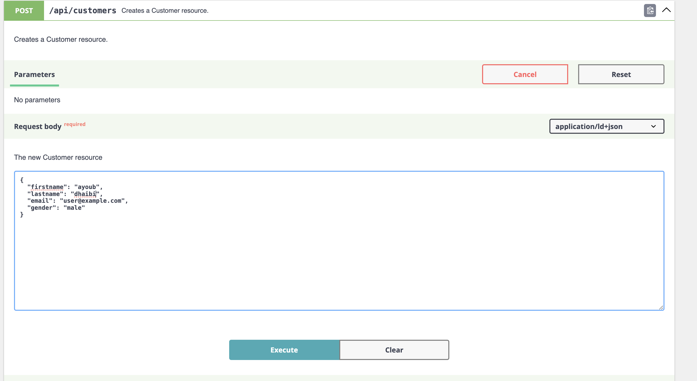
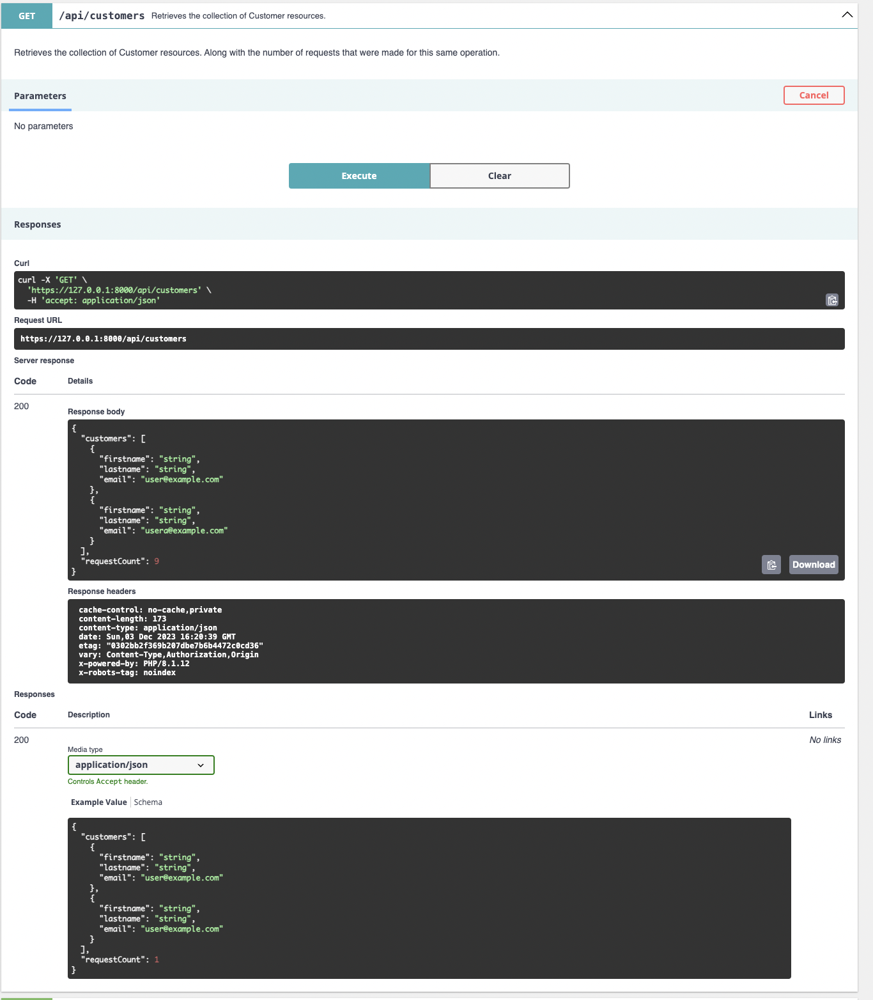
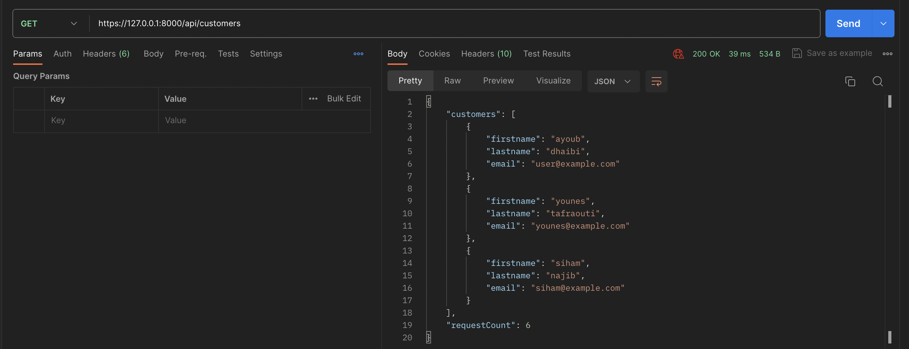
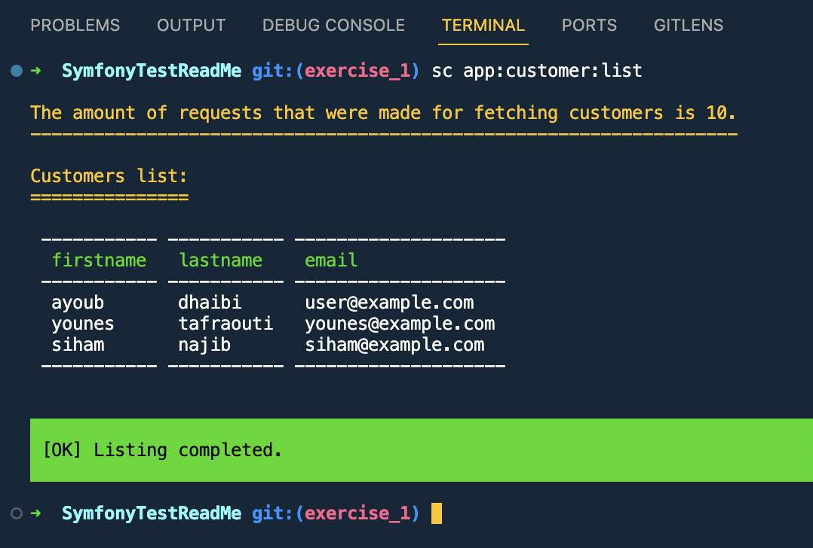
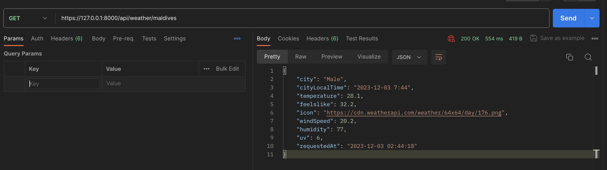
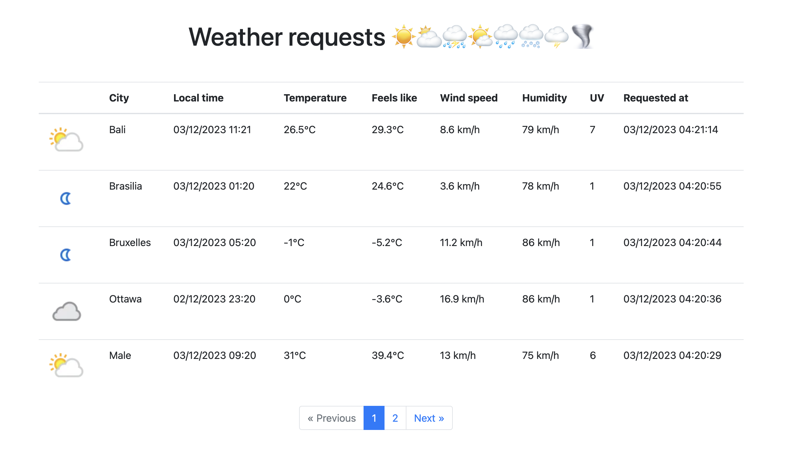
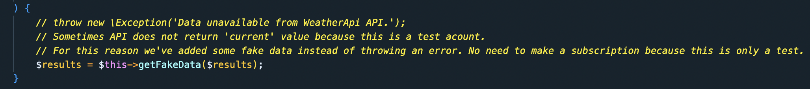

Projet : Test Symfony
====

Cette Application web est créée dans le but de tester les competences etc.

Ce projet est rélisé en suivant les bonnes pratiques et les recommandations mis par l'equipe symfony [Symfony Best Practices][1].

Les pré-requis
-----

* PHP 8.1 ou superieur;
* composer

Installation (Symfony)
----

Pour installer le projet vous pouvez uriliser:

**Git :** [Git][2] pour cloner le projet.

**Composer :** [Composer][3] pour inataller les différentes dépendances.

```bash
# Clonez la repository et installer les dependenses
$ git clone https://github.com/dhaibiayoub/SymfonyTest.git SymfonyTest
$ cd SymfonyTest/
$ composer install
```

Variables d'environnement
----

Créer le fichier `.env.local` et ajoutez dedons les variables suivantes:\
Modifier en fonction de la configuration de votre base de données locale.

```bash
APP_ENV=dev

###> doctrine/doctrine-bundle ###
DATABASE_HOST=127.0.0.1
DATABASE_PORT=3306
DATABASE_USER=root
DATABASE_PASSWORD=root
DATABASE_NAME=test_symfony
DATABASE_URL="mysql://${DATABASE_USER}:${DATABASE_PASSWORD}@${DATABASE_HOST}:${DATABASE_PORT}/${DATABASE_NAME}?serverVersion=8.0.34&charset=utf8mb4"
###< doctrine/doctrine-bundle ###
```

* Supprime le cache (pour générer le cache de l'environnement `dev`)

```bash
# Clear cache
$ php bin/console c:c
```

Tests (Facultative)
-----

Si vous souhaittez lancer les analyses et vérifications PHPStan et PHP CS Fixer:

```bash
# Intall tools dependencies
$ composer i --working-dir=tools/
$ composer phpstan
$ composer cs-fix-dry
```

\
Exercice 1 - Api Platform | Action classes | Event | Command
-----

Vous trouverais ici les étapes ainsi que les commandes nécessaires pour chaque étape.

* Vous êtes actuellement dans la branch `main`. Il faut changer vers la branche qui contient cett exercice `exercise_1`:

```bash
# Switch branch
$ git checkout exercise_1
```

* Installer les dependenses de lié à l'exercice:

```bash
# Intall dependencies
$ composer install
```

* Ensuite créez une base de données:

```bash
# Create database
$ php bin/console doctrine:database:create
```

* Lancer les migrations:

```bash
# Run all migrations
$ php bin/console doctrine:migrations:migrate
```

* Enfin, demmarez le serveur Symfony:

```bash
# Run symfony server
$ symfony serve
```

* Vous pouvez maintenant acceder à:
  * L'application sur l'URL suivante (l'URL par defaut) <http://127.0.0.1:8000>
  * L'api `Swagger UI` sur l'URL suivant <http://127.0.0.1:8000/api>
  * L'api `ReDoc` sur l'URL suivant <http://127.0.0.1:8000/api/docs?ui=re_doc>

***Tests:***
___

* Entrez dans l'api `Swagger UI`.
* Développer le menu de création de client `POST` et cliquez sur `Try it out`.\

* Créer pliseurs clients pour les visualiser apres dans la liste (`Execute`).\

* Développer le menu de récupération de la liste des clients `GET` et cliquez sur `Try it out` puis `Execute`.\

* Lancer la récupération des clients plusieurs fois et remarquez que le champ `requestCount` s'incrémente à chaque appel.
* Lancer la command symfony pour lister la liste des clients existant en base données.

```bash
# Run command to list all customer, along with the number of requests.
$ php bin/console app:customer:list
```



* Lancer plusieurs fois est remarquez que le nombre des appels faites s'incrémente à chaque appel.

```bash
The amount of requests that were made for fetching customers is 11.
```

* **Et voilà !!! Test terminé**

* ATTENTION: Avant de passer à l'exercice suivant, supprimer la base de données utilisée.

```bash
# Dekete the useed database. To create new one with another schema later.
$ php bin/console doctrine:database:drop --force
```

\
Exercice 2 (Bonus) - Weather API | Requests history
-----

Vous trouverais ici les étapes ainsi que les commandes nécessaires pour chaque étape juste comme avant.

* Changer vers la branche qui contient cett exercice `exercise_2`:

```bash
# Switch branch
$ git checkout exercise_2
```

* Ajouter les variables d'environnement suivante dans le fichier `.env.local`:\
`OPEN_WEATHER_API_KEY` : 0347e07db7004828aed195243230212

```bash
###> WeatherApi ###
OPEN_WEATHER_API_KEY="0347e07db7004828aed195243230212"
###< WeatherApi ###
```

* Installer les dependenses de lié à l'exercice:

```bash
# Intall dependencies
$ composer install
```

* Ensuite créez une base de données:

```bash
# Create database
$ php bin/console doctrine:database:create
```

* Lancer les migrations:

```bash
# Run all migrations
$ php bin/console doctrine:migrations:migrate
```

* Enfin, demmarez le serveur Symfony:

```bash
# Run symfony server
$ symfony serve
```

* Vous pouvez maintenant acceder à:
  * L'application sur l'URL suivant (l'URL par defaut) <http://127.0.0.1:8000>.
  * L'api pour demander la metéo d'une ville sur l'URL suivant <https://127.0.0.1:8000/api/weather/paris>.

  * La page de visualisation de l'historique des demandes de metéo sur l'URL suivant <https://127.0.0.1:8000/weather>.


***Tests:***
___

* Lancer plusieurs appels à l'endpoint de récupération des information de la metéo par ville.

* Accéder à la page de l'historique des demandes, afin de visualiser les différents appels qui ont été fait.

***Note!!!***

* J'ai utilisé un compte gratuit pour consomer le service de l'api **WeatherApi**, du coup je remarque parfois que certaines données manquent dans la réponse API. 
* Pour cette raison j'ai créé une fonction qui retourne une **réponse Fake** dans ce cas.
* Bien sûr le cas mentionné est rare, mais juste pour ne pas bloquer vos tests si c'est le cas.


[1]: https://symfony.com/doc/current/best_practices.html
[2]: https://git-scm.com/
[3]: https://getcomposer.org/
